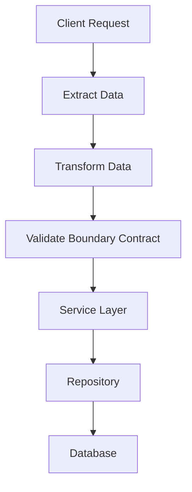

# Backend from First Principles — Day 6

# Validation and Transformation: The Gatekeepers of Data Integrity

> *“Never trust client input. Every request must pass through a validation and transformation boundary before reaching business logic.”*

---

## Introduction: Your API Cannot Trust Anyone

Imagine a registration API receiving thousands of requests every day.

Some requests come from the official website. Others come from a mobile application, an older version of the frontend, a third-party integration, an automated script, or someone using `curl` and Postman. A few may come from people deliberately trying to break the system.

The endpoint expects this:

```json
{
  "name": "Belema",
  "email": "belema@email.com",
  "age": 21
}
```

But clients can send this:

```json
{
  "name": 42,
  "email": "not-an-email",
  "age": "twenty-one",
  "role": "admin"
}
```

Or this:

```json
{
  "name": "A".repeat(1000000),
  "email": null,
  "age": -500
}
```

The first request contains wrong types, an invalid email, and a field the registration form never offered. The second can waste memory, violate business rules, and cause failures deep inside the application.

None of this requires a sophisticated attacker. A frontend bug, stale mobile client, copy-and-paste mistake, or misunderstood API contract can produce the same result.

That leads to one of the most important principles in backend engineering:

> **Data from outside the application is untrusted until the application proves otherwise.**

Authentication does not change that. A logged-in user can still submit malformed data. TypeScript does not change it either. Static types help developers write code, but they do not inspect JSON arriving over the network at runtime.

This article follows one `Create User` request from raw HTTP input to a safe service call. Along the way, I will explain where validation belongs, why transformation deserves its own stage, how syntactic, type, and semantic rules differ, and which protections still belong in the database.

The goal is larger than learning a validation library. It is learning how to build a trustworthy boundary around business logic.

## 1. The Journey of Data Through an API

When I started backend development, my mental model looked like this:

```text
Frontend → Backend → Database
```

That picture is not wrong, but it hides the most important transition: the point where external data becomes application data.

A more useful flow is:



In plain text:

```text
Client
  ↓
Request boundary: extract → transform → validate
  ↓
Service: business rules and orchestration
  ↓
Repository: persistence operations
  ↓
Database: stored data and integrity constraints
```

Each stage answers a different question.

| Stage | Question |
| --- | --- |
| Extract | Which values does this operation need? |
| Transform | How should external representations become internal values? |
| Validate | Does the resulting input satisfy the request contract? |
| Service | Is this business operation allowed and meaningful? |
| Repository | How should the application read or write data? |
| Database | Which integrity rules must always hold in storage? |

### The Application Boundary

Validation should happen at the application boundary **before data reaches business logic**.

In Express, that boundary might be implemented with middleware, a request schema, or a controller helper. In NestJS, it may use DTOs and validation pipes. Other frameworks have filters, binders, serializers, or request validators.

The exact framework mechanism is less important than the responsibility:

```text
Raw request must not flow directly into the service.
```

The service should not receive `req.body` and hope every caller prepared it correctly. It should receive a small object with known fields and known types.

Instead of this:

```ts
await userService.createUser(req.body);
```

I want this:

```ts
await userService.createUser(validatedUser);
```

That variable name represents a real guarantee: the boundary has already extracted, transformed, and checked the public request contract.

### Validation Does Not Belong Only in Controllers

Saying “validation happens in the controller” is too narrow.

Request validation commonly happens **around** the controller boundary, but important rules exist deeper in the system:

- middleware may reject an oversized request before JSON parsing;
- a schema may validate request shape and primitive values;
- a service may enforce permissions, state transitions, and business rules;
- a database may enforce unique constraints, foreign keys, and check constraints.

These protections are not careless duplication. They defend different kinds of truth.

## 2. One Create User Request, End to End

Let us use one request throughout the article:

```http
POST /users HTTP/1.1
Content-Type: application/json

{
  "name": " Belema ",
  "email": "BELEMA@EMAIL.COM",
  "age": "21"
}
```

The values make sense to a human, but they are not yet ready for the service.

- `name` has unnecessary outer whitespace;
- `email` uses inconsistent casing;
- `age` is a string rather than a number.

The boundary will move through four steps:

```text
Extract → Transform → Validate → Service
```

### Step 1: Extract the Input

An HTTP request contains much more than the JSON body. It may contain path parameters, query parameters, selected headers, cookies, and trusted authentication context.

Extraction means choosing only what this operation accepts.

For `POST /users`, that might be:

```ts
const rawInput = {
  name: req.body.name,
  email: req.body.email,
  age: req.body.age,
};
```

This explicit mapping is safer than passing the complete body into the database. If a caller adds `role: "admin"`, it never enters the command simply because the property exists.

Extraction is an allowlist:

```text
The endpoint accepts name, email, and age.
Everything else is outside the contract.
```

### Step 2: Transform External Representations

The raw input is:

```json
{
  "name": " Belema ",
  "email": "BELEMA@EMAIL.COM",
  "age": "21"
}
```

The application wants:

```json
{
  "name": "Belema",
  "email": "belema@email.com",
  "age": 21
}
```

That conversion is transformation.

```text
" Belema "          → trim whitespace → "Belema"
"BELEMA@EMAIL.COM"  → normalize case  → "belema@email.com"
"21"                → parse integer   → 21
```

Transformation is not proof that the result is valid. The string `"twenty-one"` cannot become a valid integer, and `"-500"` can become a number while still violating the accepted range.

The rule is:

> **Transform according to an explicit policy, then validate the transformed result.**

### Step 3: Validate the Request Contract

After transformation, the boundary checks:

```text
Is name a non-empty string within the length limit?
Does email follow the accepted format?
Is age an integer in the accepted range?
Were any unknown fields supplied?
```

If one of these rules fails, the request stops here. The service is never called.

### Step 4: Call the Service

Only after the boundary succeeds should the controller call:

```ts
const user = await userService.createUser(validatedUser);
```

The service can now focus on business questions:

```text
Is this email already registered?
May the current actor create this kind of user?
Which events should be published after creation?
Should a welcome email be scheduled?
```

It does not need to rediscover whether `age` is an array or whether `name` is missing.

## 3. The Three Levels of Validation

The word **valid** can mean several things. Dividing validation into three levels makes the rules easier to place and explain.

### Syntactic Validation: Does It Look Correct?

Syntactic validation checks the structure and visible format of the request.

For the Create User API, it asks:

- are required fields present?
- is the name within its allowed length?
- does the email match an accepted email format?
- is the body an object rather than an array?
- are unknown fields rejected?

Examples:

| Input | Result | Reason |
| --- | --- | --- |
| `{ "name": "Belema" }` | Fail | Email is missing |
| `{ "email": "belema@" }` | Fail | Email format is incomplete |
| `{ "name": "Belema", "role": "admin" }` | Fail | `role` is not accepted here |

Syntactic validity does not prove that an email exists or belongs to the user. It only checks the public format.

### Type Validation: Is It the Correct Data Type?

Type validation checks the runtime representation.

Expected:

```json
{ "age": 25 }
```

Received:

```json
{ "age": "25" }
```

The second value contains numeric characters, but it is still a string.

This difference matters in JavaScript:

```js
20 + 5;     // 25
"20" + "5"; // "205"
```

For JSON bodies, an API may choose strict types and require the client to send a number. This article intentionally accepts the documented string form and transforms it first. Both policies can be valid; silent and inconsistent coercion is the problem.

Type validation also needs precision:

```ts
typeof null; // "object"
typeof NaN;  // "number"
```

A production schema should distinguish arrays, non-null objects, finite numbers, safe integers, optional properties, and nullable properties.

### Semantic Validation: Does It Make Sense?

Semantic validation checks meaning and current business context.

Examples include:

- age cannot be negative;
- an email cannot already belong to another user;
- a referenced team must exist;
- a normal member cannot create an administrator;
- an order cannot jump from `pending` directly to `delivered`;
- a booking end date must be after its start date.

Some semantic rules use only the transformed input. Others require current database state, authenticated identity, or a transaction.

This is why business validation should not be forced entirely into an HTTP schema. A service owns the business operation and must protect its invariants regardless of whether it was called by a controller, background job, or message consumer.

## 4. Transformation Is a First-Class Boundary

HTTP does not understand the business types in my application. It carries representations: URL text, header text, cookie values, JSON primitives, and uploaded bytes. The application must convert accepted representations into meaningful internal values.

Consider pagination:

```http
GET /users?page=10
```

The query value is text:

```ts
{ page: "10" }
```

The repository needs a number:

```ts
{ page: 10 }
```

The safe flow is not simply `parseInt(value)`:

```ts
function parsePositiveInteger(value: unknown): number | undefined {
  if (typeof value !== "string" || !/^\d+$/.test(value)) {
    return undefined;
  }

  const number = Number(value);

  return Number.isSafeInteger(number) && number >= 1
    ? number
    : undefined;
}
```

Why check the full string first?

```ts
parseInt("10pages", 10); // 10
```

Partial parsing can hide broken clients.

### Common Transformations

| External value | Transformation | Internal value |
| --- | --- | --- |
| `" Belema "` | Trim outer whitespace | `"Belema"` |
| `"BELEMA@EMAIL.COM"` | Normalize by email policy | `"belema@email.com"` |
| Query `"10"` | Strict integer parsing | `10` |
| Query `"false"` | Exact boolean parsing | `false` |
| ISO timestamp | Parse and verify | Date/time representation |

Boolean parsing deserves special attention:

```ts
Boolean("false"); // true
```

Every non-empty string is truthy. A strict parser should map only accepted values:

```ts
function parseBoolean(value: unknown): boolean | undefined {
  if (value === "true") return true;
  if (value === "false") return false;
  return undefined;
}
```

Dates also need a documented contract. A birthday such as `2001-04-10` is a calendar date. A payment time such as `2026-08-06T09:00:00Z` is an exact instant. Converting both blindly with `new Date()` can introduce timezone bugs.

Transformation is therefore not cleanup. It is a deliberate translation between two models.

## 5. A Production-Style TypeScript and Zod Implementation

The following Express example keeps the code readable while showing the complete boundary.

### Request Schema

```ts
import { z } from "zod";

const ageFromRequest = z
  .union([z.string(), z.number()])
  .transform((value, context) => {
    const normalized =
      typeof value === "number"
        ? value
        : /^\d+$/.test(value)
          ? Number(value)
          : Number.NaN;

    if (!Number.isSafeInteger(normalized)) {
      context.addIssue({
        code: "custom",
        message: "Age must be a whole number.",
      });

      return z.NEVER;
    }

    return normalized;
  })
  .pipe(z.number().int().min(0).max(150));

const createUserSchema = z
  .object({
    name: z.string().trim().min(1).max(80),
    email: z.string().trim().toLowerCase().email().max(254),
    age: ageFromRequest,
  })
  .strict();

type CreateUserInput = z.infer<typeof createUserSchema>;
```

Read the schema as a pipeline:

```text
name  → must be text → trim → validate length
email → must be text → trim → lowercase → validate format
age   → accept documented string/number → transform → validate integer and range
body  → reject unknown fields
```

After parsing, TypeScript knows the output shape:

```ts
type CreateUserInput = {
  name: string;
  email: string;
  age: number;
};
```

This type was earned through runtime validation. It was not created by asserting `req.body as CreateUserInput`.

### Controller

```ts
import type { NextFunction, Request, Response } from "express";

export async function createUserController(
  req: Request,
  res: Response,
  next: NextFunction,
) {
  try {
    const parsed = createUserSchema.safeParse({
      name: req.body.name,
      email: req.body.email,
      age: req.body.age,
    });

    if (!parsed.success) {
      return res.status(400).json({
        type: "validation_error",
        message: "The request contains invalid fields.",
        errors: parsed.error.issues.map((issue) => ({
          field: issue.path.join("."),
          code: issue.code,
          message: issue.message,
        })),
      });
    }

    const validatedUser: CreateUserInput = parsed.data;
    const user = await userService.createUser(validatedUser);

    return res.status(201).json({
      id: user.id,
      name: user.name,
      email: user.email,
      age: user.age,
    });
  } catch (error) {
    return next(error);
  }
}
```

The controller performs HTTP work:

```text
extract request values
parse the request contract
return a 400 validation response when needed
call the service with trusted input
shape the public response
```

It does not query the database directly or place business workflows inside the route.

### Service

```ts
class EmailAlreadyRegisteredError extends Error {}

export const userService = {
  async createUser(input: CreateUserInput) {
    const existingUser = await userRepository.findByEmail(input.email);

    if (existingUser) {
      throw new EmailAlreadyRegisteredError();
    }

    try {
      return await userRepository.create(input);
    } catch (error) {
      if (isUniqueEmailConstraintViolation(error)) {
        throw new EmailAlreadyRegisteredError();
      }

      throw error;
    }
  },
};
```

The service checks email uniqueness because it is a business rule requiring current state. It still handles a database uniqueness violation because two requests can race:

```text
Request A checks email → available
Request B checks email → available
Request A inserts user
Request B attempts insert
```

Only a unique database constraint can make the final decision safely.

### Repository and Database

```ts
export const userRepository = {
  findByEmail(email: string) {
    return database.user.findUnique({ where: { email } });
  },

  create(input: CreateUserInput) {
    return database.user.create({
      data: {
        name: input.name,
        email: input.email,
        age: input.age,
      },
      select: {
        id: true,
        name: true,
        email: true,
        age: true,
      },
    });
  },
};
```

Business validation should not be hidden inside repositories. Repositories should focus on persistence. However, repositories and databases absolutely participate in data integrity through:

- parameterized queries or safe ORM APIs;
- unique indexes;
- foreign keys;
- `NOT NULL` and check constraints;
- transactions and atomic updates.

The application gives clients useful errors. The database protects facts that must remain true under concurrency.

## 6. What a Validation Failure Should Look Like

A client needs enough information to correct its request without receiving internal implementation details.

```json
{
  "type": "validation_error",
  "message": "The request contains invalid fields.",
  "errors": [
    {
      "field": "email",
      "code": "invalid_format",
      "message": "Enter a valid email address."
    },
    {
      "field": "age",
      "code": "out_of_range",
      "message": "Age must be between 0 and 150."
    }
  ]
}
```

Stable error codes help clients translate messages and connect errors to form fields. A request ID can help support teams trace failures.

The response should not contain passwords, access tokens, stack traces, raw SQL, database table names, or the complete malicious payload.

Status code conventions vary, but consistency matters:

- `400 Bad Request` or `422 Unprocessable Content` for request validation failures;
- `403 Forbidden` for a known caller without permission;
- `404 Not Found` for an unavailable resource where disclosure is appropriate;
- `409 Conflict` for uniqueness or current-state conflicts;
- `500 Internal Server Error` for unexpected server failures.

## 7. Frontend Validation vs Backend Validation

If the browser already checks a registration form, why should the API repeat the work?

Because the two layers serve different purposes.

### Frontend Validation Improves the Experience

The frontend can respond immediately while the user is typing. It can:

- highlight a missing field;
- show an email-format message;
- display a password requirement checklist;
- preserve completed fields after an error;
- focus the first invalid input;
- provide accessible feedback without waiting for a network request.

This makes the product faster and easier to use.

But the client runs on a device the user controls. Someone can disable JavaScript, modify the request in developer tools, use an older application build, or call the API directly:

```bash
curl -X POST https://api.example.com/users \
  -H 'Content-Type: application/json' \
  -d '{"name":42,"email":"bad","role":"admin"}'
```

Frontend validation can always be bypassed.

### Backend Validation Protects the System

The backend owns the protected operation and current data. It must independently enforce:

- accepted fields and runtime types;
- lengths, formats, and ranges;
- permissions and business rules;
- uniqueness and relationships;
- persistence constraints.

The backend is the authoritative boundary. It guarantees that every client—official or unofficial—must follow the same contract.

The relationship can be summarized in one sentence:

> **Frontend validation is a convenience. Backend validation is a security requirement.**

The best applications use both. The frontend gives instant, accessible feedback. The backend guarantees security and data integrity.

Even when frontend and backend share a TypeScript schema, the backend must run it again against the data it actually receives. Shared code reduces drift; it does not transfer trust.

## 8. Production Lessons That Go Beyond a Schema

A validation library is useful, but production safety depends on more than field rules.

### Limit Work Before Parsing

Set limits for request bodies, headers, strings, arrays, files, pagination, and nesting depth. A value can be syntactically correct while being large enough to exhaust memory or overload the database.

### Reject or Explicitly Strip Unknown Fields

Do not spread `req.body` into an ORM call. Construct an allowlisted input object so future database columns do not accidentally become public API fields.

### Use Defaults Only for Missing Values

If `page` is absent, defaulting to page 1 may be reasonable. If a client sends `page=banana`, silently returning page 1 hides a broken contract. Present-but-invalid input should normally receive an error.

### Keep Validation Separate From Injection Defenses

Validation does not replace protections designed for a destination:

| Destination | Primary protection |
| --- | --- |
| SQL | Parameterized queries or safe ORM APIs |
| HTML | Context-aware output encoding |
| Shell | Avoid command construction; use argument APIs |
| Redirect URLs | Allowlisted schemes and destinations |
| File storage | Server-controlled paths, content checks, and size limits |

There is no universal `sanitize()` function that makes a value safe in every context.

### Test the Boundary, Not Only the Happy Path

If a name must contain 1–80 characters, test:

```text
0 characters  → fail
1 character   → pass
80 characters → pass
81 characters → fail
```

Also test missing fields, `null`, empty strings, whitespace-only strings, wrong primitive types, nested malformed data, unknown fields, Unicode input, concurrent uniqueness attempts, and safe public errors.

### Observe Rejections Without Logging Secrets

Metrics such as validation failures by endpoint and error code can reveal broken clients or attacks. Log request IDs and safe metadata, not passwords, tokens, or entire sensitive payloads.

### Treat Validation Rules as API Compatibility

Making a rule stricter can break deployed clients. Measure current input, update the documented contract, coordinate clients, add observability, and version the API when necessary.

## 9. The Engineering Principle Behind the Code

The most valuable lesson is not how to call `safeParse`.

It is learning to control where trust enters a system.

A senior engineer does not ask only:

```text
How do I validate this field?
```

They also ask:

```text
What can the caller control?
Where does external data become application data?
Which transformations are part of the public contract?
Which rule needs current business state?
Which guarantee must survive concurrent requests?
What information could an error expose?
Can a different entry point bypass this rule?
```

Those questions lead to a durable set of principles.

### Never Trust External Input

Browsers, mobile applications, partner services, message queues, file uploads, and authenticated users all cross trust boundaries. Treat their data as unknown until checked.

### Validate at System Boundaries

Reject malformed data before it spreads into business logic. In web applications, this commonly happens through request schemas, middleware, pipes, DTO validation, and controllers.

### Keep Business Logic Clean

Do not make services navigate `req.body`, parse query strings, or know HTTP status codes. Give them explicit, trustworthy command objects.

### Transform Data Into Meaningful Internal Formats

Convert documented external representations once, at the boundary. Deeper layers should work with numbers, booleans, normalized identifiers, and date representations that match the domain.

### Let Services Focus on Business Rules

Services decide whether operations are permitted and meaningful under current state. They protect workflows, relationships, permissions, and state transitions.

### Let Databases Protect Data Integrity

Unique indexes, foreign keys, check constraints, transactions, and atomic updates are not optional backups. They are authoritative safeguards for stored truth.

## Conclusion

The Create User request began as three untrusted values:

```json
{
  "name": " Belema ",
  "email": "BELEMA@EMAIL.COM",
  "age": "21"
}
```

The boundary extracted only accepted fields, transformed them into meaningful internal values, validated the resulting contract, and handed the service this:

```ts
{
  name: "Belema",
  email: "belema@email.com",
  age: 21,
}
```

The service then focused on business meaning. The repository handled persistence. The database protected uniqueness under concurrency.

That is the architecture in one line:

```text
Extract → Transform → Validate → Service → Repository → Database
```

Good validation is not a pile of defensive `if` statements. It is a deliberate boundary where uncertain external data becomes trustworthy application input.

Once that boundary is clear, the rest of the system becomes easier to reason about. Services become cleaner. Errors become more useful. Database rules become more intentional. Security stops depending on the behavior of one frontend.

The engineering principle I will carry forward is this:

> **Do not let raw requests become business data by accident. Make every value earn trust before it can influence the system.**
